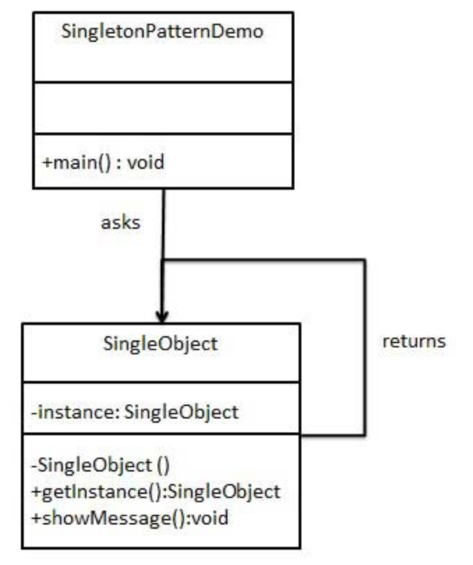
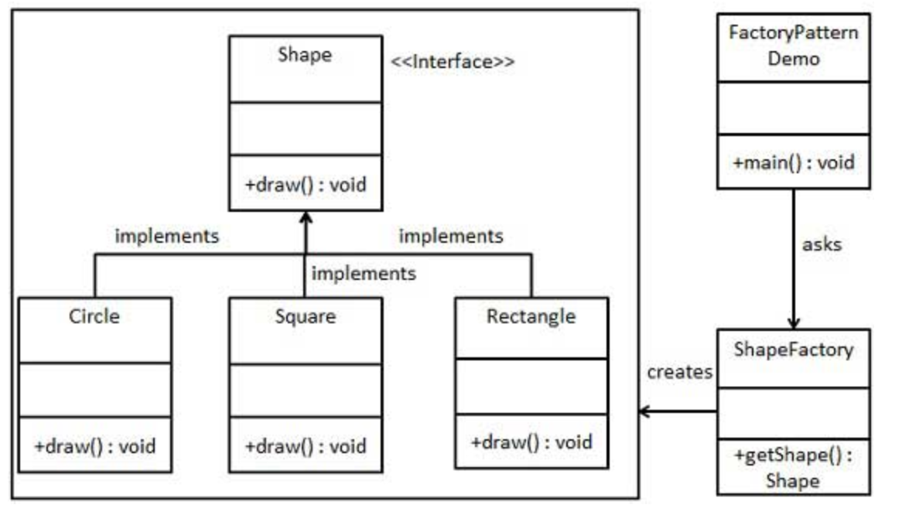
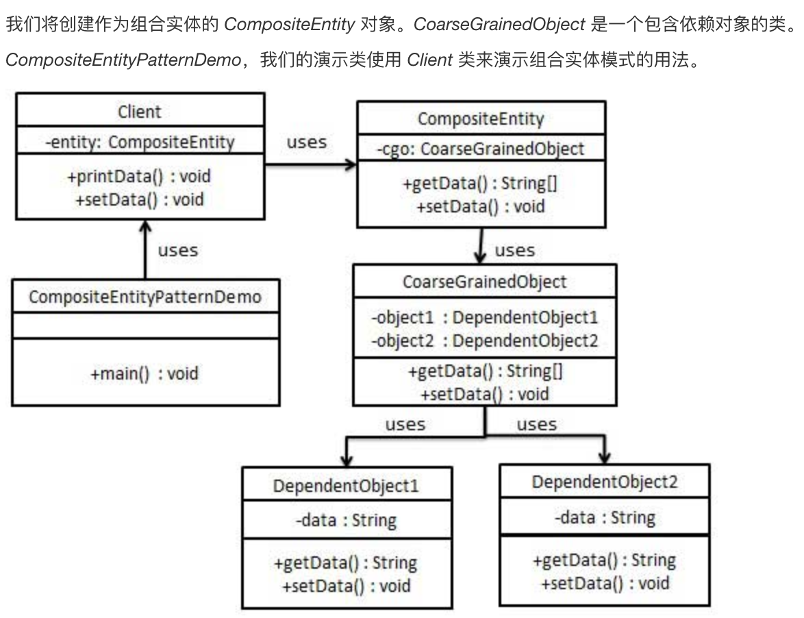

<!-- TOC -->

- [学习Java设计模式](#学习java设计模式)
    - [1.单例模式](#1单例模式)
        - [1.1简介](#11简介)
        - [1.2实现](#12实现)
        - [1.3几种实现方式](#13几种实现方式)
    - [2.工厂模式](#2工厂模式)
        - [2.1简介](#21简介)
        - [2.2实现](#22实现)
    - [3.组合模式](#3组合模式)
        - [3.1简介](#31简介)
        - [3.2实现](#32实现)

<!-- /TOC -->
# 学习Java设计模式

## 1.单例模式

* 1、单例类只能有一个实例。
* 2、单例类必须自己创建自己的唯一实例。
* 3、单例类必须给所有其他对象提供这一实例。

### 1.1简介

* 意图：保证一个类仅有一个实例，并提供一个访问它的全局访问点。
* 主要解决：一个全局使用的类频繁地创建与销毁。
* 何时使用：当您想控制实例数目，节省系统资源的时候。
* 如何解决：判断系统是否已经有这个单例，如果有则返回，如果没有则创建。
* 关键代码：构造函数是私有的。

优点：

* 1、在内存里只有一个实例，减少了内存的开销，尤其是频繁的创建和销毁实例（比如管理学院首页页面缓存）。
* 2、避免对资源的多重占用（比如写文件操作）。

缺点：

* 没有接口，不能继承，与单一职责原则冲突，一个类应该只关心内部逻辑，而不关心外面怎么样来实例化。

### 1.2实现



代码实现：

* 创建一个 Singleton 类

```public class SingleObject {
   //创建 SingleObject 的一个对象
   private static SingleObject instance = new SingleObject();
   //让构造函数为 private，这样该类就不会被实例化
   private SingleObject(){}
   //获取唯一可用的对象
   public static SingleObject getInstance(){
      return instance;
   }
   public void showMessage(){
      System.out.println("Hello World!");
   }
}
```

* 从 singleton 类获取唯一的对象

```public class SingletonPatternDemo {
   public static void main(String[] args) {
      //不合法的构造函数
      //编译时错误：构造函数 SingleObject() 是不可见的
      //SingleObject object = new SingleObject();
      //获取唯一可用的对象
      SingleObject object = SingleObject.getInstance();
      //显示消息
      object.showMessage();
   }
}
```

### 1.3几种实现方式

* 1.3.1懒汉式，线程不安全

```public class Singleton {  
    private static Singleton instance;  
    private Singleton (){}  
  
    public static Singleton getInstance() {  
    if (instance == null) {  
        instance = new Singleton();  
    }  
    return instance;  
    }  
}
```

* 1.3.2懒汉式，线程安全

```public class Singleton {  
    private static Singleton instance;  
    private Singleton (){}  
    public static synchronized Singleton getInstance() {  
    if (instance == null) {  
        instance = new Singleton();  
    }  
    return instance;  
    }  
}
```

* 1.3.3饿汉模式

```public class Singleton {  
    private static Singleton instance = new Singleton();  
    private Singleton (){}  
    public static Singleton getInstance() {  
    return instance;  
    }  
}
```

* 1.3.4双检锁/双重校验锁

```public class Singleton {  
    private volatile static Singleton singleton;  
    private Singleton (){}  
    public static Singleton getSingleton() {  
    if (singleton == null) {  
        synchronized (Singleton.class) {  
        if (singleton == null) {  
            singleton = new Singleton();  
        }  
        }  
    }  
    return singleton;  
    }  
}
```

* 1.3.5登记式/静态内部类

```public class Singleton {  
    private static class SingletonHolder {  
    private static final Singleton INSTANCE = new Singleton();  
    }  
    private Singleton (){}  
    public static final Singleton getInstance() {  
    return SingletonHolder.INSTANCE;  
    }  
}
```

* 1.3.6枚举模式

```public enum Singleton {  
    INSTANCE;  
    public void whateverMethod() {  
    }  
}
```

## 2.工厂模式

在工厂模式中，我们在创建对象时不会对客户端暴露创建逻辑，并且是通过使用一个共同的接口来指向新创建的对象。

### 2.1简介

* 意图：定义一个创建对象的接口，让其子类自己决定实例化哪一个工厂类，工厂模式使其创建过程延迟到子类进行。
* 主要解决：主要解决接口选择的问题。
* 何时使用：我们明确地计划不同条件下创建不同实例时。
* 如何解决：让其子类实现工厂接口，返回的也是一个抽象的产品。
* 关键代码：创建过程在其子类执行。

优点：

* 1、一个调用者想创建一个对象，只要知道其名称就可以了。
* 2、扩展性高，如果想增加一个产品，只要扩展一个工厂类就可以。
* 3、屏蔽产品的具体实现，调用者只关心产品的接口。

缺点：

* 每次增加一个产品时，都需要增加一个具体类和对象实现工厂，使得系统中类的个数成倍增加，在一定程度上增加了系统的复杂度，同时也增加了系统具体类的依赖。这并不是什么好事。

### 2.2实现



* 创建一个接口：

```public interface Shape {
   void draw();
}
```

* 创建实现接口的实体类

```public class Rectangle implements Shape {
   @Override
   public void draw() {
      System.out.println("Inside Rectangle::draw() method.");
   }
}
```

```public class Square implements Shape {
   @Override
   public void draw() {
      System.out.println("Inside Square::draw() method.");
   }
}
```

```public class Circle implements Shape {
   @Override
   public void draw() {
      System.out.println("Inside Circle::draw() method.");
   }
}
```

* 创建一个工厂，生成基于给定信息的实体类的对象

```public class ShapeFactory {
   //使用 getShape 方法获取形状类型的对象
   public Shape getShape(String shapeType){
      if(shapeType == null){
         return null;
      }
      if(shapeType.equalsIgnoreCase("CIRCLE")){
         return new Circle();
      } else if(shapeType.equalsIgnoreCase("RECTANGLE")){
         return new Rectangle();
      } else if(shapeType.equalsIgnoreCase("SQUARE")){
         return new Square();
      }
      return null;
   }
}
```

* 使用该工厂

```public class FactoryPatternDemo {
 
   public static void main(String[] args) {
      ShapeFactory shapeFactory = new ShapeFactory();
 
      //获取 Circle 的对象，并调用它的 draw 方法
      Shape shape1 = shapeFactory.getShape("CIRCLE");
 
      //调用 Circle 的 draw 方法
      shape1.draw();
 
      //获取 Rectangle 的对象，并调用它的 draw 方法
      Shape shape2 = shapeFactory.getShape("RECTANGLE");
 
      //调用 Rectangle 的 draw 方法
      shape2.draw();
 
      //获取 Square 的对象，并调用它的 draw 方法
      Shape shape3 = shapeFactory.getShape("SQUARE");
 
      //调用 Square 的 draw 方法
      shape3.draw();
   }
}
```

## 3.组合模式

### 3.1简介

* 组合实体（Composite Entity） - 它是主要的实体 bean。它可以是粗粒的，或者可以包含一个粗粒度对象，用于持续生命周期。
* 粗粒度对象（Coarse-Grained Object） - 该对象包含依赖对象。它有自己的生命周期，也能管理依赖对象的生命周期。
* 依赖对象（Dependent Object） - 依赖对象是一个持续生命周期依赖于粗粒度对象的对象。
* 策略（Strategies） - 策略表示如何实现组合实体。

### 3.2实现



* 创建依赖对象

```public class DependentObject1 {
   private String data;
   public void setData(String data){
      this.data = data;
   }
   public String getData(){
      return data;
   }
}
```

```public class DependentObject2 {
   private String data;
   public void setData(String data){
      this.data = data;
   }
   public String getData(){
      return data;
   }
}
```

* 创建粗粒度对象。

```public class CoarseGrainedObject {
   DependentObject1 do1 = new DependentObject1();
   DependentObject2 do2 = new DependentObject2();
   public void setData(String data1, String data2){
      do1.setData(data1);
      do2.setData(data2);
   }
   public String[] getData(){
      return new String[] {do1.getData(),do2.getData()};
   }
}
```

* 创建组合实体。

```public class CompositeEntity {
   private CoarseGrainedObject cgo = new CoarseGrainedObject();
   public void setData(String data1, String data2){
      cgo.setData(data1, data2);
   }
   public String[] getData(){
      return cgo.getData();
   }
}
```

* 创建使用组合实体的客户端类。

```public class Client {
   private CompositeEntity compositeEntity = new CompositeEntity();
   public void printData(){
      for (int i = 0; i < compositeEntity.getData().length; i++) {
         System.out.println("Data: " + compositeEntity.getData()[i]);
      }
   }
   public void setData(String data1, String data2){
      compositeEntity.setData(data1, data2);
   }
}
```

* 使用 Client 来演示组合实体设计模式的用法。

```public class CompositeEntityPatternDemo {
   public static void main(String[] args) {
       Client client = new Client();
       client.setData("Test", "Data");
       client.printData();
       client.setData("Second Test", "Data1");
       client.printData();
   }
}
```

