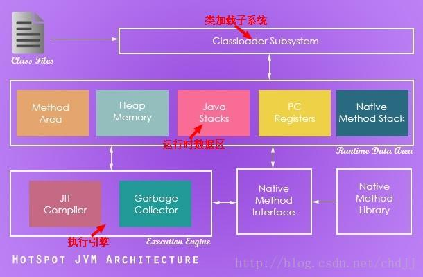
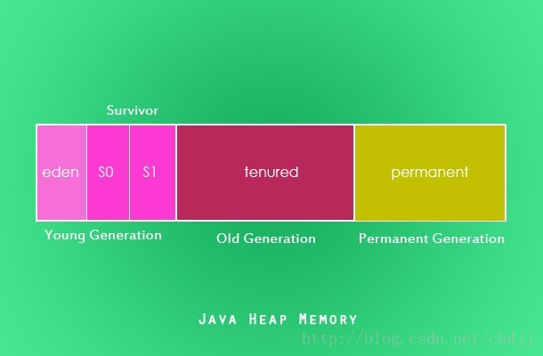

# GC

java中，对象内存空间的分配与回收都是通过JVM的gc进程自动进行的

## 基础

### java核心术语：

* 1.java API：帮助java程序员构建java应用程序的一系列类库集合；
* 2.JDK：java开发工具集，使java程序员构建java程序的一系列工具，包括编译，执行，管理，分发，监控等多方面内容。
* 3.JVM：java虚拟机，根据虚拟机规范编写，不同平台的虚拟机实现有所不同，JVM屏蔽了底层操作系统的差异性。
* 4.JRE:java运行时环境。

### Hot Spot虚拟机:

不同的JVM实现可能基于不同的垃圾回收方式，Sun被收购前使用的是JRockit虚拟机，被Oracle收购后使用的是HotSpot。在不久的将来，两个不同的JVM实现将合二为一。

### JVM体系结构：

在Java虚拟机中，跟垃圾回收相关的两个核心组件就是对内存和gc回收器，堆内存是运行时数据区的一个组成部分，java实例将被分配在其中，GC回收器作用的也正是这块区域。

### Java堆内存

java实例都将存储在堆内存中，当一个对象没有被任何其他对象引用时，它就可以被垃圾收集器回收了，堆内存有三个核心区域：

* 1.新生代。
    1.Eden区域
    2.S0 Survivor
    3.S1 Survivor
* 2.老年代。
* 3.永久代。（注：永久代现已从堆内存中移除，即现在的方法区）。

## GC工作原理

java垃圾回收其实是由一个可以进行自动内存管理的进程完成的，这使得程序员在写代码的时候不必过多考虑内存释放与回收的问题。

### 垃圾收集器如何初始化

Java提供了System.gc()和Runtime.gc()方法。但是JVM可以选择忽略程序员的请求，因而不要指望虚拟机能够足够听话。事实上，它总是基于堆内存Eden区域的内存分配情况来作出判断。

### 垃圾收集进程

垃圾收集就是一个回收无用空间使之将来可以重新分配给其他对象用的进程。

### 堆分区

* Eden区域：当实例被创建，优先存储在新生代的Eden区域。
* Survivor区域（S0和S1）：作为Minor GC（新生代GC）生命周期的一个步骤，Eden区域中的存活对象将会被移到S0区域，而S0区域中的存活对象在被GC扫描之后将会被移到S1区域。而死亡对象将会被GC标记，被标记的对象可能会在标记后由此进程去回收也可能由一个单独的进程去回收。
* 老年代：老年代是堆内存的另一个逻辑组成部分，gc执行完MinorGC之后，某些在S1区域中依旧存活的对象将会晋升到老年代
* MajorGC:MajorGC其实就是老年代GC，在此期间，垃圾收集进程会扫描老年代中所有对象，标记死亡对象，被标记的对象随后将会被回收而其他对象依旧存活。
* 内存碎片：当被标记的对象被清除后，堆内存会出现一些“空洞”，即内存碎片。为了提高对象分配的速度，我们应该清除掉这些内存碎片。

### 实例的终结

对象实例被回收之前，垃圾收集器可能会调用其finalize方法，因而对象可以在此方法中进行一些资源释放的操作

* 1.如果在回收一个垃圾对象的过程中出现异常，默认将会被忽略，并且取消回收该对象实例。
* 2.虚拟机规范并没有对虚引用的垃圾回收过程进行强制规定，细节由虚拟机实现者决定。
* 3.垃圾回收过程是由一个守护线程执行的。

### 对象何时能回收

* 1.一个线程访问不到该对象实例；
* 2.该对象（或者是若干对象循环引用）不被任何其他对象所引用。
* 在java编译器编译优化期间，可以选择给一个对象赋null表示该对象不再可用，可以被回收。

## 垃圾收集器类型

### 串行垃圾收集器

串行垃圾收集器工作时会暂停所有应用线程，它是为单线程环境设计的。它仅仅使用一个线程进行垃圾回收。它的这种暂停其他所有线程的行为（"stop the world"）对于服务端的环境来说并不适合，其仅仅适合简单的命令行程序。
使用 -XX:+UseSerialGC 参数配置此垃圾收集器。

### 并行垃圾收集器

它也被称为吞吐量收集器(throughput collector)。它是虚拟机默认的垃圾收集器。与串行垃圾收集器不同的是此垃圾收集器使用多线程回收垃圾。与串行垃圾收集器类似的是它同样也会暂停所有应用线程当它在进行垃圾回收的时候。

### CMS垃圾收集器

并发标记-清除垃圾收集器（Concurrent Mark Sweep Garbage Collector）使用多线程扫描堆内存标记待回收对象然后清除被标记对象。CMS垃圾收集器仅仅在下面两个情景下暂停所有应用线程：

* 1.标记老年代的垃圾对象时；
* 2.垃圾收集时堆内存大小发生改变时

与并行垃圾收集器相比，CMS垃圾收集器需要消耗更多的CPU去提高应用的吞吐量，如果CPU允许的话，CMS垃圾收集器是一个更好的选择。
使用 -XX:+UseParNewGC 参数配置此垃圾收集器。

### G1垃圾收集器

G1垃圾收集器用于大范围的堆区域。它将堆内存分为若干区域并在每个区域中进行并行垃圾收集，并且在垃圾回收之后会进行清理工作（清理内存碎片），但是清理工作需要暂停所有应用进程（stop the world）,G1垃圾收集器优先收集具有更多垃圾的区域。
使用 -XX:+UseG1GC 参数配置此垃圾收集器。