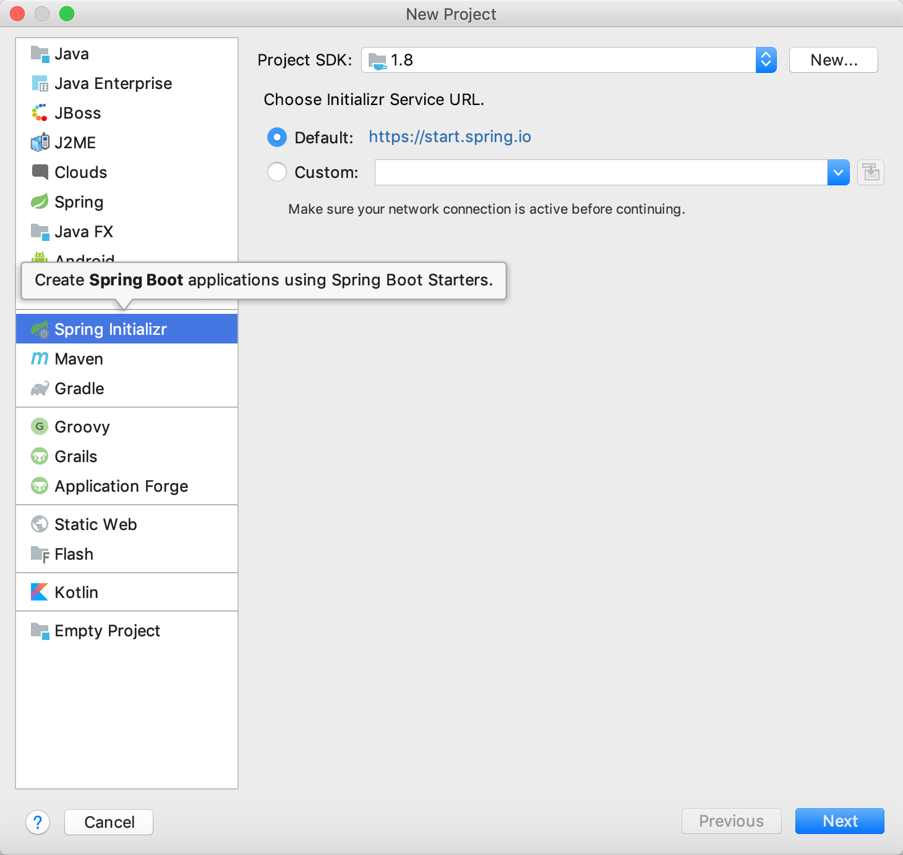
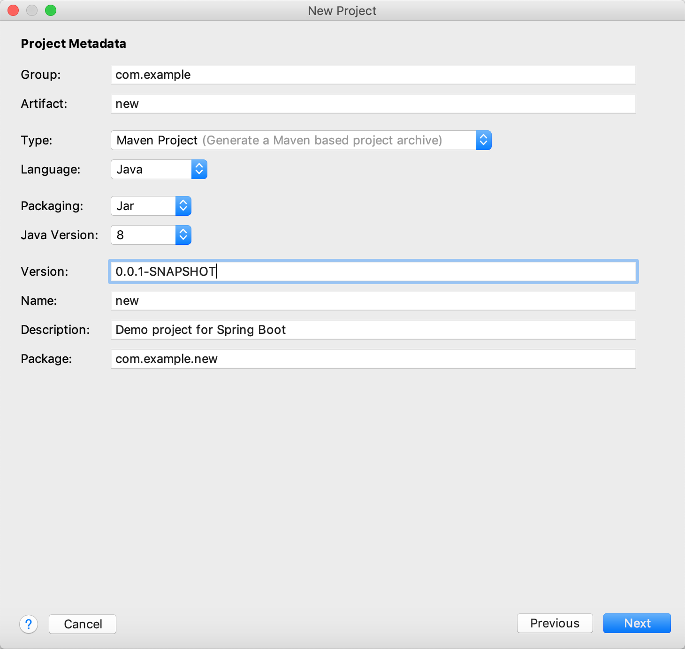
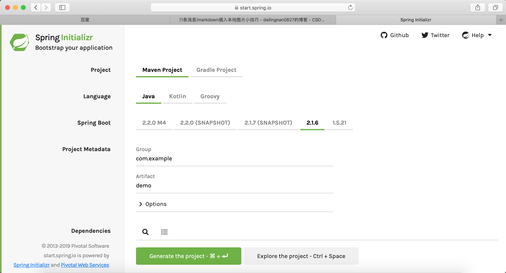

<!-- TOC -->

- [知识汇总](#知识汇总)
    - [1 Spring boot的快速搭建](#1-spring-boot的快速搭建)
        - [1.1 Spring boot配置数据库连接池](#11-spring-boot配置数据库连接池)
    - [mybatis的使用](#mybatis的使用)
        - [Springboot mybatis generate 自动生成实体类和Mapper](#springboot-mybatis-generate-自动生成实体类和mapper)
    - [数据库的学习](#数据库的学习)
        - [rbac权限管理模式](#rbac权限管理模式)
        - [数据库建表、和索引](#数据库建表和索引)
        - [数据结构的树、二叉树、完全二叉树、满二叉树、二叉查询树、红黑树](#数据结构的树二叉树完全二叉树满二叉树二叉查询树红黑树)

<!-- /TOC -->

# 知识汇总

## 1 Spring boot的快速搭建

* 利用idea可以一键生成Springboot项目，如果没有idea也可以用`https://start.spring.io`，Spring官方的生成工具生成springboot项目
* 使用springboot，可以省去我们配置的工作，能让我们把工作重心放到业务业务代码上





### 1.1 Spring boot配置数据库连接池

```
spring.datasource.url=jdbc:mysql://localhost:3306/test
spring.datasource.username=root
spring.datasource.password=123456
spring.datasource.driver-class-name=com.mysql.jdbc.Driver
````

## mybatis的使用

可以直接用注解写sql语句@select(select * from t_user)
也可以在xml文件中配置sql语句，但不推荐这么用了

### Springboot mybatis generate 自动生成实体类和Mapper

* pom.xml文件导入

```
<dependency>
            <groupId>org.mybatis.generator</groupId>
            <artifactId>mybatis-generator-core</artifactId>
            <version>1.3.5</version>
        </dependency>
```
* 在resources目录下创建mybatis-generator文件夹，并mybatis-generator文件夹中创建generatorConfig.xml文件和mybatisGeneratorinit.properties文件

* mybatisGeneratorinit.properties配置
```
jdbc_driver=com.mysql.jdbc.Driver
jdbc_url=jdbc:mysql://localhost:3306/zentao?useUnicode=true&characterEncoding=utf-8&useSSL=true
jdbc_user=root
jdbc_password=root
models=E:\\CodeTest\\dd-demo\\src\\main\\java
resources=E:\\CodeTest\\dd-demo\\src\\main\\resources
dao=E:\\CodeTest\\dd-demo\\src\\main\\java
```
* generatorConfig.xml 文件配置
```
<?xml version="1.0" encoding="UTF-8"?>
<!DOCTYPE generatorConfiguration
        PUBLIC "-//mybatis.org//DTD MyBatis Generator Configuration 1.0//EN"
        "http://mybatis.org/dtd/mybatis-generator-config_1_0.dtd">
<!-- 配置生成器 -->
<generatorConfiguration>
    <!--执行generator插件生成文件的命令： call mvn mybatis-generator:generate -e -->
    <!-- 引入配置文件 -->
    <properties resource="mybatis-generator/mybatisGeneratorinit.properties"/>
    <!--classPathEntry:数据库的JDBC驱动,换成你自己的驱动位置 可选 -->
    <!--<classPathEntry location="E:\mybatis\mysql-connector-java-5.1.24-bin.jar" /> -->
 
    <!-- 一个数据库一个context -->
    <!--defaultModelType="flat" 大数据字段，不分表 -->
    <context id="MysqlTables" targetRuntime="MyBatis3Simple" defaultModelType="flat">
        <!-- 自动识别数据库关键字，默认false，如果设置为true，根据SqlReservedWords中定义的关键字列表；
        一般保留默认值，遇到数据库关键字（Java关键字），使用columnOverride覆盖 -->
        <property name="autoDelimitKeywords" value="true" />
        <!-- 生成的Java文件的编码 -->
        <property name="javaFileEncoding" value="utf-8" />
        <!-- beginningDelimiter和endingDelimiter：指明数据库的用于标记数据库对象名的符号，比如ORACLE就是双引号，MYSQL默认是`反引号； -->
        <property name="beginningDelimiter" value="`" />
        <property name="endingDelimiter" value="`" />
 
        <!-- 格式化java代码 -->
        <property name="javaFormatter" value="org.mybatis.generator.api.dom.DefaultJavaFormatter"/>
        <!-- 格式化XML代码 -->
        <property name="xmlFormatter" value="org.mybatis.generator.api.dom.DefaultXmlFormatter"/>
        <plugin type="org.mybatis.generator.plugins.SerializablePlugin" />
 
        <plugin type="org.mybatis.generator.plugins.ToStringPlugin" />
 
        <!-- 注释 -->
        <commentGenerator >
            <property name="suppressAllComments" value="false"/><!-- 是否取消注释 -->
            <property name="suppressDate" value="true" /> <!-- 是否生成注释代时间戳-->
        </commentGenerator>
 
        <!-- jdbc连接 -->
        <jdbcConnection driverClass="${jdbc_driver}" connectionURL="${jdbc_url}" userId="${jdbc_user}" password="${jdbc_password}" />
        <!-- 类型转换 -->
        <javaTypeResolver>
            <!-- 是否使用bigDecimal， false可自动转化以下类型（Long, Integer, Short, etc.） -->
            <property name="forceBigDecimals" value="false"/>
        </javaTypeResolver>
 
        <!-- 生成实体类地址 -->
        <javaModelGenerator targetPackage="dd.springboot.demo.models" targetProject="${models}" >
            <property name="enableSubPackages" value="false"/>
            <property name="trimStrings" value="true"/>
        </javaModelGenerator>
        <!-- 生成mapxml文件 -->
        <sqlMapGenerator targetPackage="mapper" targetProject="${resources}" >
            <property name="enableSubPackages" value="false" />
        </sqlMapGenerator>
        <!-- 生成mapxml对应client，也就是接口dao -->
        <javaClientGenerator targetPackage="dd.springboot.demo.dao" targetProject="${dao}" type="XMLMAPPER" >
            <property name="enableSubPackages" value="true" />
        </javaClientGenerator>
        <!-- table可以有多个,每个数据库中的表都可以写一个table，tableName表示要匹配的数据库表,也可以在tableName属性中通过使用%通配符来匹配所有数据库表,只有匹配的表才会自动生成文件 -->
        <!--如果想生成一个表则tableName="table_name"-->
        <table tableName="%"
               enableCountByExample="true"
               enableUpdateByExample="true"
               enableDeleteByExample="true"
               enableSelectByExample="true"
               selectByExampleQueryId="true">
            <property name="useActualColumnNames" value="false" />
            <!-- 数据库表主键 -->
            <generatedKey column="id" sqlStatement="Mysql" identity="true" />
        </table>
    </context>
</generatorConfiguration>
```

## 数据库的学习

### rbac权限管理模式

用户通过扮演不用角色，来获取不同的权限，访问不同的菜单，来实现权限的管理。

我们去要创建用户表、角色表、权限表、和菜单表

### 数据库建表、和索引

### 数据结构的树、二叉树、完全二叉树、满二叉树、二叉查询树、红黑树