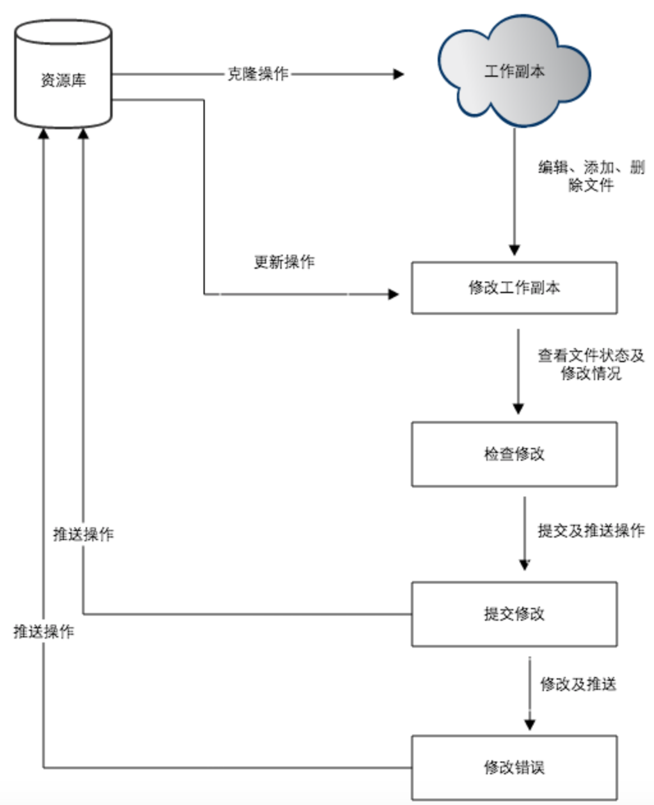

# 学习git

## git概述

* git与svn的区别：

git分布，svn不分布，git没有一个全局的版本号（这是git缺少的最大的一个特征），git把内容按元数据存储，svn按文件

## git安装配置

## git工作流程

## git基本操作

* git init初始化一个仓库，会在对应文件夹生成.git目录

git init filesname指定目录作为仓库

* git add 添加文件到库中，

* git commit 提交添加到库中的文件。后面添加-m，可以在提交时添加描述。git commit -m ‘描述的文字’

* 使用git commit钱要先设置用户名和邮箱

git comfig --global user.name 'yourname'

git comfig --global user.email youremail

* git clone 克隆一个项目到本地

git clone <repo> <directory>：repo为gt仓库，directory为本地目录

* git status 查看上次提交后是否有修改，加上-s参数，以简短的内容输出

* git diff 查看git status结果的详细信息

* git rest HEAD 用于取消已经git add的内容

可以使用git commit -am '在次提交'，来再次提交该文件。

* git rm删除文件

git rm -f强制删除

git rm -cached 只删除暂存区，不删除工作空间

* git mv 移动，重命名，软连接

## git分支管理

* git branch 查看分支

git branch -al，查看远程仓库的全部分支

* git branch brancgname，创建分支，名字为brancgname

* git checkout branchname，切换到branchname分支，切换分支时，git会用该分支最后提交的快照替换工作目录内容

git checkout -b branchname，创建分支，并立刻切换到该分支

* git merge 合并分支，git merge branchname

git branch -d branchname ：删除分支

* git remote add name URL 连接远程仓库

* git remote rm name 删除远程仓库

