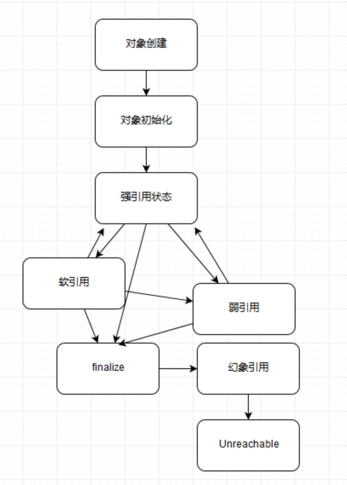
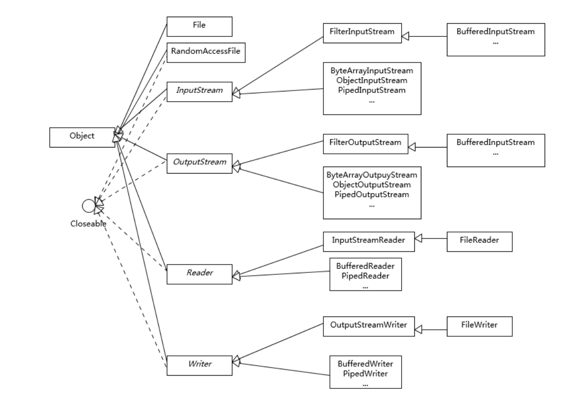

# 极客时间Java核心技术36讲学习

## 1、对Java平台的理解

## 2、exception和error的区别

## 3、final、finally、finalize有什么不同

## 4、强应用、弱应用、软引用、幻像引用有什么区别

在Java语言中，除了基本数据类型外，其他的都是指向各类对象的对象引用；Java中根据其生命周期的长短，将引用分为4类。

### 4.1几种引用类型

* 1、强引用

我们平常典型编码Object obj = new Object()中的obj就是强引用。通过关键字new创建的对象所关联的引用就是强引用。 当JVM内存空间不足，JVM宁愿抛出OutOfMemoryError运行时错误（OOM），使程序异常终止，也不会靠随意回收具有强引用的“存活”对象来解决内存不足的问题。对于一个普通的对象，如果没有其他的引用关系，只要超过了引用的作用域或者显式地将相应（强）引用赋值为 null，就是可以被垃圾收集的了，具体回收时机还是要看垃圾收集策略。

* 2、软引用

软引用通过SoftReference类实现。 软引用的生命周期比强引用短一些。只有当 JVM 认为内存不足时，才会去试图回收软引用指向的对象：即JVM 会确保在抛出 OutOfMemoryError 之前，清理软引用指向的对象。软引用可以和一个引用队列（ReferenceQueue）联合使用，如果软引用所引用的对象被垃圾回收器回收，Java虚拟机就会把这个软引用加入到与之关联的引用队列中。后续，我们可以调用ReferenceQueue的poll()方法来检查是否有它所关心的对象被回收。如果队列为空，将返回一个null,否则该方法返回队列中前面的一个Reference对象。

* 3、弱引用

弱引用通过WeakReference类实现。 弱引用的生命周期比软引用短。在垃圾回收器线程扫描它所管辖的内存区域的过程中，一旦发现了具有弱引用的对象，不管当前内存空间足够与否，都会回收它的内存。由于垃圾回收器是一个优先级很低的线程，因此不一定会很快回收弱引用的对象。弱引用可以和一个引用队列（ReferenceQueue）联合使用，如果弱引用所引用的对象被垃圾回收，Java虚拟机就会把这个弱引用加入到与之关联的引用队列中。

* 4、幻像引用

虚引用也叫幻象引用，通过PhantomReference类来实现。无法通过虚引用访问对象的任何属性或函数。幻象引用仅仅是提供了一种确保对象被 finalize 以后，做某些事情的机制。如果一个对象仅持有虚引用，那么它就和没有任何引用一样，在任何时候都可能被垃圾回收器回收。虚引用必须和引用队列 （ReferenceQueue）联合使用。当垃圾回收器准备回收一个对象时，如果发现它还有虚引用，就会在回收对象的内存之前，把这个虚引用加入到与之关联的引用队列中。
ReferenceQueue queue = new ReferenceQueue ();
PhantomReference pr = new PhantomReference (object, queue); 
程序可以通过判断引用队列中是否已经加入了虚引用，来了解被引用的对象是否将要被垃圾回收。如果程序发现某个虚引用已经被加入到引用队列，那么就可以在所引用的对象的内存被回收之前采取一些程序行动。

### 4.2对象可达性

所有引用类型，都是抽象类 java.lang.ref.Reference的子类，并且提供了get（）方法。如果对象没有被销毁都可以通过get（）方法获得原方法，幻像引用除外，幻像引用返回值永远是null。所以软引用和弱引用可以变为强引用

## 5、string、stringbuffer、stringbuilder的区别

### 5.1string

string不是基本类型！string不是基本类型！string不是基本类型！

string是由一个char数组实现的，而这个数组被定义为了final修饰，所以这也决定了string的不变性，但是在开发中常常会有字符串拼接，这时都会产生一个新的new string（），所以性能很低。

### 5.2stringbuffer

stringbuffer则没有不变性，我们可以用add方法，来添加字符串在指定位置。其本质是一个线程安全的可修改字符序列，由于保证了线程安全，所以带来了额外的性能开销。

### 5.3stringbuilder

和stringbuffer基本差不多，但是是线程不安全的

### 5.4扩展

因为stringbuffer和stringbuilder的实现也是用过数组，我们知道数组是有长度限制的，他们的默认长度为16，所以，当我们拼接的字符串大于长度时，就会进行扩容操作，如果多次扩容则会消耗性能。所以他们提供的构造方法，可以在创建的时候指定长度，但是长度过长又会浪费内存，所以要平衡好。

#### 5.4.x 字符串缓存

java6以后提供了intern（）方法，提示jvm将相应字符串对象缓存起来，但是缓存的位置在永代区，他不会被fullgc之外的gc清理，很容易被占满。
在或许的版本中，这个缓存被放在了堆中。
在jdk8后又退出了新特性，也就是g1 gc下的字符串排重。通过将相同数据的字符串指向同一份数据，是jvm底层的改变。

## 6、动态代理是基于什么原理

通过反射我们可以直接操作类或者对象，获取类声明的属性和方法，获取类声明的属性和方法，调用方法或者构造对象，甚至可以运行时修改类定义。

动态代理是一种方便运行时动态构建代理、动态处理代理方法调用的机制，很多场景都是利用类似机制做到的，比如用来包装 RPC调用、面向切面的编程（AOP）。

实现动态代理的方式很多，比如 JDK 自身提供的动态代理，就是主要利用了上面提到的反射机制。还有其他的实现方式，比如利用传说中更高性能的字节码操作机制，类似 ASM、cglib（基于 ASM）、Javassist 等。

* 静态代理：事先写好代理类，可以手工编写，也可以用工具生成。缺点是每个业务类都要对应一个代理类，非常不灵活。
* 动态代理：运行时自动生成代理对象。缺点是生成代理代理对象和调用代理方法都要额外花费时间。
* JDK动态代理：基于Java反射机制实现，必须要实现了接口的业务类才能用这种办法生成代理对象。新版本也开始结合ASM机制。
* cglib动态代理：基于ASM机制实现，通过生成业务类的子类作为代理类。
* Java 发射机制的常见应用：动态代理（AOP、RPC）、提供第三方开发者扩展能力（Servlet容器，JDBC连接）、第三方组件创建对象（DI）

### 反射

反射最大的作用之一就在于我们可以不在编译时知道某个对象的类型，而在运行时通过提供完整的”包名+类名.class”得到。注意：不是在编译时，而是在运行时。

* 在运行时能判断任意一个对象所属的类。
* 在运行时能构造任意一个类的对象。
* 在运行时判断任意一个类所具有的成员变量和方法。
* 在运行时调用任意一个对象的方法。

特点：

由于反射会额外消耗一定的系统资源，因此如果不需要动态地创建一个对象，那么就不需要用反射。另外，反射调用方法时可以忽略权限检查，因此可能会破坏封装性而导致安全问题。

## 7、int和integer的区别

### 7.1基本类型

* 整数型：byte、short、int、long
* 浮点数：float、double
* 字符型：char
* 布尔型：boolean

### 7.2integer

integer是int的包装类，它有一个int类型的字段存储数据，并且提供的基本操作。在Java5过后，引入了自动装箱和自动拆箱功能，Java可以根据上下文，自动转换。

### 7.3理解自动装箱、自动拆箱

整数型，javac会为我们自动装箱转换为 integer.valueof()，拆箱为integer.intvalue()，因为调用了valueof()，所以装箱时能够得到缓存的好处。

这种缓存机制其他类也有：

* Boolean：缓存了true/false
* Short：缓存了-128～127
* Byte：缓存全部
* Character：缓存’\u0000’ 到 ‘\u007F’

### 7.4注意

* [1] 基本类型均具有取值范围，在大数*大数的时候，有可能会出现越界的情况。
* [2] 基本类型转换时，使用声明的方式。例：long result= 1234567890 * 24 * 365；结果值一定不会是你所期望的那个值，因为1234567890 * 24已经超过了int的范围，如果修改为：long result= 1234567890L * 24 * 365；就正常了。
* [3] 慎用基本类型处理货币存储。如采用double常会带来差距，常采用BigDecimal、整型（如果要精确表示分，可将值扩大100倍转化为整型）解决该问题。
* [4] 优先使用基本类型。原则上，建议避免无意中的装箱、拆箱行为，尤其是在性能敏感的场合，
* [5] 如果有线程安全的计算需要，建议考虑使用类型AtomicInteger、AtomicLong 这样的线程安全类。部分比较宽的基本数据类型，比如 float、double，甚至不能保证更新操作的原子性，可能出现程序读取到只更新了一半数据位的数值。

## 8、对比vector、arraylist、linkedlist

Vector、ArrayList、LinkedList均为线型的数据结构，但是从实现方式与应用场景中又存在差别。

1 底层实现方式
ArrayList内部用数组来实现；LinkedList内部采用双向链表实现；Vector内部用数组实现。

2 读写机制
ArrayList在执行插入元素是超过当前数组预定义的最大值时，数组需要扩容，扩容过程需要调用底层System.arraycopy()方法进行大量的数组复制操作；在删除元素时并不会减少数组的容量（如果需要缩小数组容量，可以调用trimToSize()方法）；在查找元素时要遍历数组，对于非null的元素采取equals的方式寻找。

LinkedList在插入元素时，须创建一个新的Entry对象，并更新相应元素的前后元素的引用；在查找元素时，需遍历链表；在删除元素时，要遍历链表，找到要删除的元素，然后从链表上将此元素删除即可。
Vector与ArrayList仅在插入元素时容量扩充机制不一致。对于Vector，默认创建一个大小为10的Object数组，并将capacityIncrement设置为0；当插入元素数组大小不够时，如果capacityIncrement大于0，则将Object数组的大小扩大为现有size+capacityIncrement；如果capacityIncrement<=0,则将Object数组的大小扩大为现有大小的2倍。

3 读写效率

ArrayList对元素的增加和删除都会引起数组的内存分配空间动态发生变化。因此，对其进行插入和删除速度较慢，但检索速度很快。

LinkedList由于基于链表方式存放数据，增加和删除元素的速度较快，但是检索速度较慢。

4 线程安全性

ArrayList、LinkedList为非线程安全；Vector是基于synchronized实现的线程安全的ArrayList。

需要注意的是：单线程应尽量使用ArrayList，Vector因为同步会有性能损耗；即使在多线程环境下，我们可以利用Collections这个类中为我们提供的synchronizedList(List list)方法返回一个线程安全的同步列表对象。

## 9、对比hashtable、hashmap、treemap

map是以键值对形式存储和操作数据的容器类型。

### 9.1hsshtable

早期Java类库提供的一个哈希表实现，本身是同步的，不支持null值的键和值，因为同步，所以性能低，不推荐使用

### 9.2hashmap

不同步，支持null值，在进行put、get操作时可以达到常数时间的性能。是绝大部分键值对存储场景的首选

### 9.3treemap

基于红黑树，提供顺序访问的map。它的put、get操作的时间复杂度都是O(log（n）)，具体顺序可以通过Comparator 来决定，或者根据键的自然顺序来决定

### 9.4多说两句

* 元素特性
HashTable中的key、value都不能为null；HashMap中的key、value可以为null，很显然只能有一个key为null的键值对，但是允许有多个值为null的键值对；TreeMap中当未实现 Comparator 接口时，key 不可以为null；当实现 Comparator 接口时，若未对null情况进行判断，则key不可以为null，反之亦然。

* 顺序特性
HashTable、HashMap具有无序特性。TreeMap是利用红黑树来实现的（树中的每个节点的值，都会大于或等于它的左子树种的所有节点的值，并且小于或等于它的右子树中的所有节点的值），实现了SortMap接口，能够对保存的记录根据键进行排序。所以一般需要排序的情况下是选择TreeMap来进行，默认为升序排序方式（深度优先搜索），可自定义实现Comparator接口实现排序方式。

* 初始化与增长方式
初始化时：HashTable在不指定容量的情况下的默认容量为11，且不要求底层数组的容量一定要为2的整数次幂；HashMap默认容量为16，且要求容量一定为2的整数次幂。
扩容时：Hashtable将容量变为原来的2倍加1；HashMap扩容将容量变为原来的2倍。

* 线程安全性
HashTable其方法函数都是同步的（采用synchronized修饰），不会出现两个线程同时对数据进行操作的情况，因此保证了线程安全性。也正因为如此，在多线程运行环境下效率表现非常低下。因为当一个线程访问HashTable的同步方法时，其他线程也访问同步方法就会进入阻塞状态。比如当一个线程在添加数据时候，另外一个线程即使执行获取其他数据的操作也必须被阻塞，大大降低了程序的运行效率，在新版本中已被废弃，不推荐使用。
HashMap不支持线程的同步，即任一时刻可以有多个线程同时写HashMap;可能会导致数据的不一致。如果需要同步（1）可以用 Collections的synchronizedMap方法；（2）使用ConcurrentHashMap类，相较于HashTable锁住的是对象整体， ConcurrentHashMap基于lock实现锁分段技术。首先将Map存放的数据分成一段一段的存储方式，然后给每一段数据分配一把锁，当一个线程占用锁访问其中一个段的数据时，其他段的数据也能被其他线程访问。ConcurrentHashMap不仅保证了多线程运行环境下的数据访问安全性，而且性能上有长足的提升。

* HashMap
HashMap基于哈希思想，实现对数据的读写。当我们将键值对传递给put()方法时，它调用键对象的hashCode()方法来计算hashcode，让后找到bucket位置来储存值对象。当获取对象时，通过键对象的equals()方法找到正确的键值对，然后返回值对象。HashMap使用链表来解决碰撞问题，当发生碰撞了，对象将会储存在链表的下一个节点中。 HashMap在每个链表节点中储存键值对对象。当两个不同的键对象的hashcode相同时，它们会储存在同一个bucket位置的链表中，可通过键对象的equals()方法用来找到键值对。如果链表大小超过阈值（TREEIFY_THRESHOLD, 8），链表就会被改造为树形结构。

## 10、何如保证集合是线程安全的？

## 11、Java提供了哪些i/o方式

### 11.1粗略回答

* 传统的i/o方式，在java.io包下，交互是同步、阻塞的，所以效率很低，它提供了file、输入输出流等
* java.net包下的部分网络api，也归类到阻塞同步io类库，网络通信同样是io行为
* java1.4中引入的nio，在Java.nio包下，可以构建多路复用的、同步非阻塞io程序
* 在Java7中引入了nio2，异步非阻塞io，也叫aio

* 同步：

当我们进行同步操作时，后续任务是等待当前调用返回，才会进行下一步

* 异步：

其他任务不需要等待当前任务返回，通常依靠事件、回掉等机制来实现任务间的次序关系

* 阻塞

在进行阻塞操作时，当前线程会处于阻塞状态，无法从事其他任务。只有当条件就绪才能继续

* 非阻塞：

不管io操作是否结束，直接返回，相应操作在后台继续处理。

### 11.2nio

io不仅仅是对文件的操作，网络编程中，比如socket通信，都是典型的io操作目标

* 输入输出流（inputstream/outputstream）用于读取，写入字节
* reader/writer则是用于操作字符，增加了字符编解码功能。本质上计算机操作的都是字节，reader/writer相当于构建了应用逻辑和原始数据的桥梁
* bufferedinputstream/outputstream则是带缓冲的实现，可以避免频繁的磁盘读写，将批量数据进行一次操作，使用中要记住flush！

### 11.3nio

* buffer：高效的数据容器，除了布尔，所有原始数据都有对应的buffer实现
* channel：类似与linux系统上的文件扫描，是nio支持批量式io操作的一种抽象
* selector：是nio实现多路复用的基础，它能检测到组册到selector上的多个channel，并判断是否有channel处于就绪状态。
* chartest：提供unicode字符串定义，nio也提供了相应的编解码器